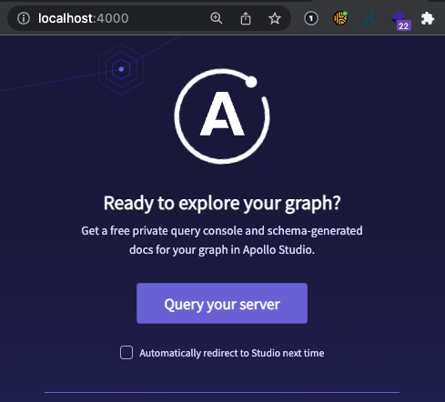

# Implementation of Apollo Server

* Server Side Packages
    * core: graphql
    * server service: apollo-server
    * data source service: apollo-datasource-rest

```bash
npm i graphql apollo-server apollo-datasource-rest
```

> Dev Dependencies: nodemon

## First, What Apollo Needs to Run

### 1. Schema

The most basic setup for Apollo Server should include an Schema, even a dummy one.

```js
const { gql } = require("apollo-server")
const typeDefs = gql`
    type Query {
        "Dumy Init"
        dummyField: String
    }
`;
module.exports = typeDefs
```

Then, It follows an Express.js Server Pattern. Then, set it up alike.

```js
const { ApolloServer } = require("apollo-server")
const typeDefs = require("./schema")

async function initApolloServer(typeDefs){
    const server = new ApolloServer({typeDefs})
    await server.listen({port: 4000})
}
initApolloServer(typeDefs)
```

Now, Apollo is reachable. But It does nothing else.




